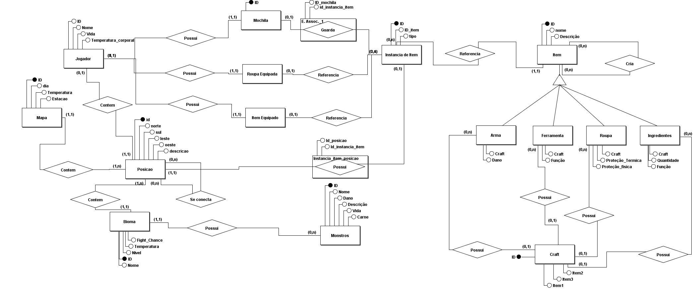
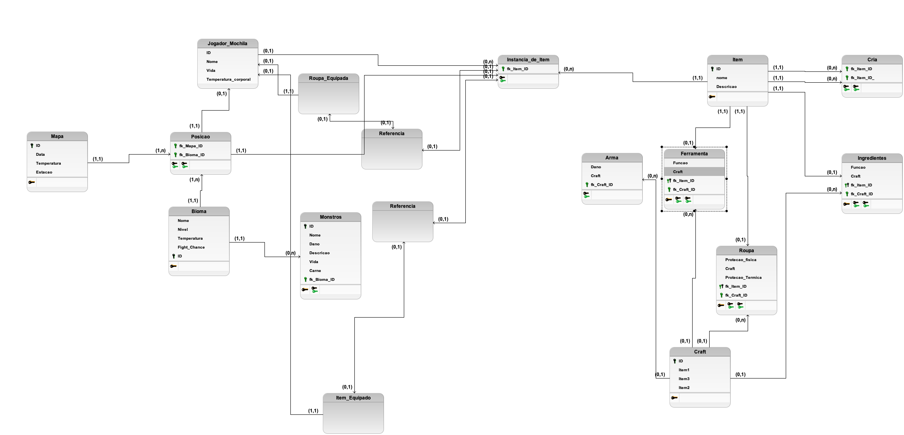
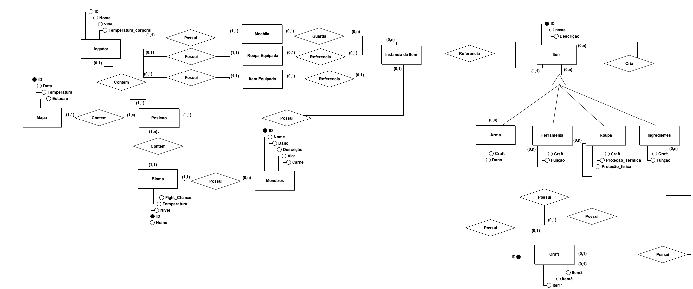

# Modelo Entidade Relacionamento

## Historico e versão

| Data       | Versão | Mensagem             | Autor                                    |
| ---------- | ------ | -------------------- | ---------------------------------------- |
| 03/07/2022 | 0.1    | Criação do documento | Luis Marques                             |
| 04/07/2022 | 0.2    | Adição de Diagramas  | Luis Marques & Caio Martins & Yuri Alves |
| 29/08/2022 | 0.3    | Refatoração do Diagrama  | Luis Marques & Caio Martins & Yuri Alves |

## introdução

Este documento contem o diagrama de Entidade-Relacionamento (DER)

## Diagrama Conceitual versão 2.0

## Diagrama Logico

Clique para apresentar a versão 1.0 do Modelo Conceitual

## Diagrama Conceitual

